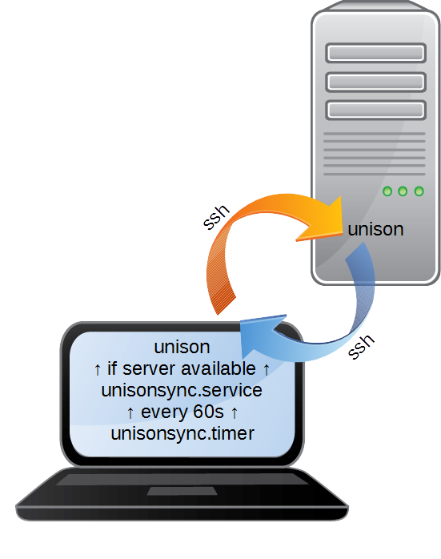

# roaming-homes

## Description
Roaming homes/profiles for linux with unison. On user login and after this every 60 seconds the user home get's synchronized with the server by user space systemd. It does not synchronize if the server is unavailable or another instance of unison is running. 

**Please share your thoughts**

## Requirements
* ssh server where user can login without password this can be accomplished either with authorized ssh keys or in combination with an identity management server e.g. FreeIPA (https://www.freeipa.org)
* same version of unison installed on both clients and server
* client OS must support user space systemd units (systemctl --user). RHEL/CentOS do not yet support it. It is planned for version 8.
* python (>=2.7)

## Installation
At the moment the rpm has to be built first. You can then copy and paste it to other clients within same distro and install it directly.
1. `yum -y install rpmdevtools` 
1. `git clone https://github.com/radiorabe/roaming-homes.git`
1. `cd roaming-homes`
1. `rpmbuild -bb roaming-homes.spec`
1. `rpm -i ~/rpmbuild/RPMS/noarch/roaming-homes*.rpm`
1. In /etc/roaming-homes/roaming-homes.conf add at least the fqdn or ip of the server to the variable SSH_SERVER

## Configuration
Almost all configuration can be done in [/etc/roaming-homes/roaming-homes.conf](src/roaming-homes.conf). Unfortunately the synchronization frequency has to be set in seconds in [/usr/lib/systemd/user/unisonsync.timer](src/unisonsync.timer). After this you'll have to reload the systemd-daemon `systemd --user --global daemon-reload`.

## FAQ
* Why unison?

  Unison supports a client and server setup. It maintains a file system modification database on both ends which makes the synchronization more efficient than e.g. with rsync. Furthermore unison provides a huge amount of settings and logic out of the box.
* Why not nfs with cache?

  The solution with nfs requires a server that is always online. roaming-homes targets devices that are not always within the corporate network such as mobile workstations.
 
## TODOs
* Make rpms available for download
* Replace optparse with argparse because it's deprecated (https://docs.python.org/2/library/optparse.html#module-optparse)
* Notifications support for other desktop environments than gnome
* Find a proper way to set synchronization interval in configuration file

## Links
* https://www.cis.upenn.edu/~bcpierce/unison/
* https://www.freedesktop.org/software/systemd/man
  * https://www.freedesktop.org/software/systemd/man/systemd.unit.html
  * https://www.freedesktop.org/software/systemd/man/systemd.timer.html
  * https://www.freedesktop.org/software/systemd/man/systemd.service.html
* https://docs.python.org/2/library/optparse.html 
* https://www.devdungeon.com/content/desktop-notifications-linux-python 
